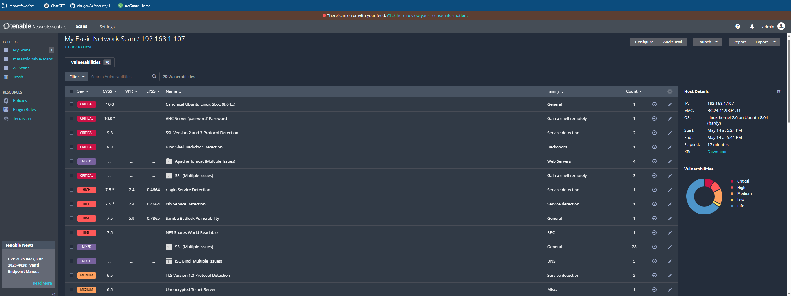

# Nessus Vulnerability Scan - Project 1

## Target
- Metasploitable VM (192.168.1.xxx)
- OS: Linux

## Nessus Setup
- Installed Nessus Essentials on Ubuntu 22.04
- Activated with free license
- UI accessible on port 8834
- First scan completed successfully

## Scan Findings
- Total Vulnerabilities: 70
- High: 7
- Medium: 27
- Notable findings: [List a couple CVEs or misconfigs]

Hardening Actions Taken on Metasploitable
Disabled Telnet in /etc/inetd.conf

Stopped and disabled Apache2
sudo /etc/init.d/apache2 stop
sudo chmod -x /etc/init.d/apache2

Stopped and disabled MySQL
sudo /etc/init.d/mysql stop
sudo chmod -x /etc/init.d/mysql

Stopped and disabled ProFTPD
sudo /etc/init.d/proftpd stop
sudo chmod -x /etc/init.d/proftpd

## Next Steps
- Document remediation steps
- Test re-scan after fixing vulnerabilities
